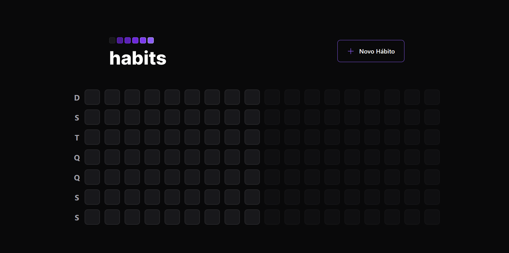

   

 

   
   
   
   

 

[**Sobre**](#-sobre) &nbsp;&nbsp;**|**&nbsp;&nbsp;
[**Features**](#-features) &nbsp;&nbsp;**|**&nbsp;&nbsp;
[**Tecnologias e Ferramentas**](#-tecnologias-e-ferramentas) &nbsp;&nbsp;

## 📃 Sobre

O projeto destina-se a criar um ecossistema [**React**](https://pt-br.reactjs.org) desenvolvendo aplicações web, mobile e api para gestão de hábitos periódicos, onde o usuário poderá criar hábitos, marcar a execução de hábitos diariamente e monitorar a quantidade de hábitos executados.

### Aplicação Web

### Aplicação Mobile

   
   
   

## ✨ Features

### Back-end

- [x] Criação de um hábito
- [x] Listagem de hábitos por dia
- [x] Marcar execução de um hábito

### Front-end (Web)

- [x] Criação de um hábito
- [x] Exibição de hábitos disponíveis por dia

### Mobile

- [x] Criação de um hábito
- [x] Exibição de hábitos disponíveis por dia

## 🚀 Tecnologias e Ferramentas

<table>
  <tbody>
    <tr>
      <td style="font-weight: bold">Back-end</td>
      <td>
        <a href="https://nodejs.org/en/" target="_blank" rel="noopener noreferrer">NodeJs</a>,
        <a href="https://www.typescriptlang.org/" target="_blank" rel="noopener noreferrer">Typescript</a>,
        <a href="https://www.prisma.io/" target="_blank" rel="noopener noreferrer">Prisma</a>,
        <a href="https://www.fastify.io/" target="_blank" rel="noopener noreferrer">Fastify</a>,
        <a href="https://zod.dev/" target="_blank" rel="noopener noreferrer">Zod</a>,
        <a href="https://www.sqlite.org/index.html" target="_blank" rel="noopener noreferrer">SQLite</a>
      </td>
    </tr>
    <tr>
      <td style="font-weight: bold">Front-end (web)</td>
      <td>
        <a href="https://reactjs.org/" target="_blank" rel="noopener noreferrer">React</a>,
        <a href="https://www.radix-ui.com/" target="_blank" rel="noopener noreferrer">Radix</a>,
        <a href="https://www.typescriptlang.org/" target="_blank" rel="noopener noreferrer">TypeScript</a>,
        <a href="https://vitejs.dev/guide/" target="_blank" rel="noopener noreferrer">Vite</a>,
        <a href="https://tailwindcss.com/" target="_blank" rel="noopener noreferrer">TailwindCSS</a>,
        <a href="https://axios-http.com/docs/intro" target="_blank" rel="noopener noreferrer">Axios</a>
      </td>
    </tr>
    <tr>
      <td style="font-weight: bold">Mobile</td>
      <td>
        <a href="https://reactnative.dev/" target="_blank" rel="noopener noreferrer">React Native</a>,
        <a href="https://expo.dev/" target="_blank" rel="noopener noreferrer">Expo</a>
      </td>
    </tr>
  </tbody>
</table>