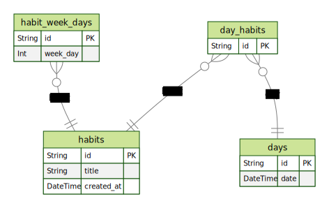

<div align="center">
   
</div>
<br/>
<div align="center">
   <a href="https://github.com/csdccarneiro">
      
   </a>
   
   
   <a href="https://github.com/csdccarneiro/nlw-habits/commits/main">
      
   </a>
</div>

</br>
<div align="center">

[**Sobre**](#-sobre) &nbsp;&nbsp;**|**&nbsp;&nbsp;
[**Diagrama**](#-diagrama) &nbsp;&nbsp;**|**&nbsp;&nbsp;
[**Features**](#-features) &nbsp;&nbsp;**|**&nbsp;&nbsp;
[**Instalação e Execução**](#-instalação-e-execução) &nbsp;&nbsp;**|**&nbsp;&nbsp;
[**Tecnologias e Ferramentas**](#-tecnologias-e-ferramentas) &nbsp;&nbsp;

</div>

## 📃 Sobre

Esse é o back-end do **NLW Habits**, aqui você pode gerenciar as rotas e personalizar os schemas do banco de dados

## 📝	 Diagrama

<p align="center">
    
</p>

## ✨ Features

### Back-end

- [x] Criação de um hábito
- [x] Listagem de hábitos por dia
- [x] Marcar/Desmarcar execução de um hábito


## 👷 Instalação e Execução

```bash
# Clone o Repositório
https://github.com/csdccarneiro/nlw-habits.git
```

```bash
# Acesse a pasta do projeto
cd nlw-habits-backend
```

```bash
# Instale as Dependências
npm install
```

```bash
# Crie as variaveis de ambiente, copiando o arquivo .env.example e renomeando para .env

# Certifique de adicionar valor para as variaveis de ambiente
cp .env.example .env
```

```bash
# Execute as Migrations do Prisma
npx prisma migrate dev
```

```bash
# Execute o Projeto.
npm run dev
```


## 🚀 Tecnologias e Ferramentas

<table>
  <tbody>
    <tr>
      <td style="font-weight: bold">Back-end</td>
      <td>
        <a href="https://nodejs.org/en/" target="_blank" rel="noopener noreferrer">NodeJs</a>,
        <a href="https://www.typescriptlang.org/" target="_blank" rel="noopener noreferrer">Typescript</a>,
        <a href="https://www.prisma.io/" target="_blank" rel="noopener noreferrer">Prisma</a>,
        <a href="https://www.fastify.io/" target="_blank" rel="noopener noreferrer">Fastify</a>,
        <a href="https://zod.dev/" target="_blank" rel="noopener noreferrer">Zod</a>,
        <a href="https://www.sqlite.org/index.html" target="_blank" rel="noopener noreferrer">SQLite</a>
      </td>
    </tr>
  </tbody>
</table>