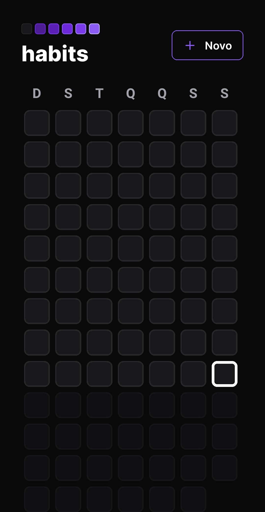
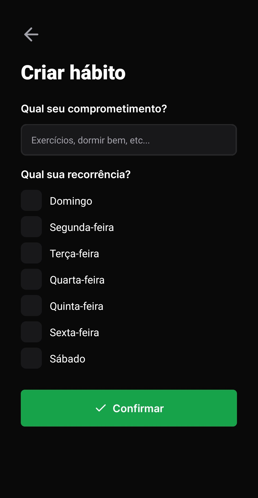
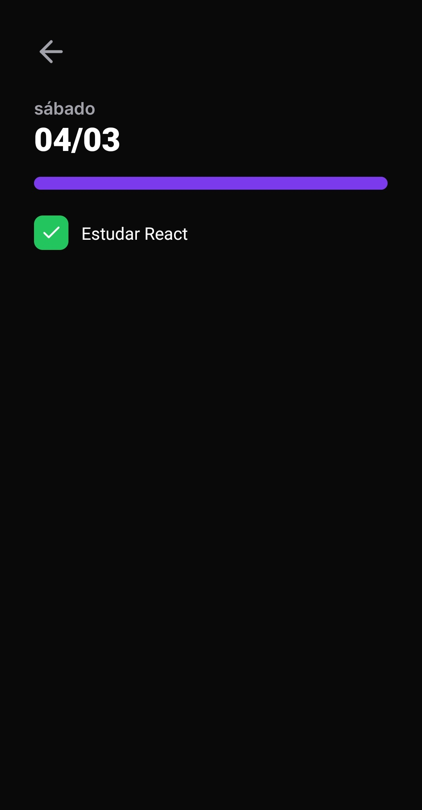

<div align="center">
   
</div>
<br/>
<div align="center">
   <a href="https://github.com/csdccarneiro">
      
   </a>
   
   
   <a href="https://github.com/csdccarneiro/nlw-habits/commits/main">
      
   </a>
</div>

</br>
<div align="center">

[**Sobre**](#-sobre) &nbsp;&nbsp;**|**&nbsp;&nbsp;
[**Features**](#-features) &nbsp;&nbsp;**|**&nbsp;&nbsp;
[**Instalação e Execução**](#-instalação-e-execução) &nbsp;&nbsp;**|**&nbsp;&nbsp;
[**Tecnologias e Ferramentas**](#-tecnologias-e-ferramentas) &nbsp;&nbsp;

</div>

## 📃 Sobre

Esse é o app mobile do **NLW Habits**, aqui você pode gerenciar os hábitos criados, marcar/desmarcar a execução do hábito e visualizar os hábitos disponíveis por dia.

<div align="center">
   
   
   
</div>

## ✨ Features

### Mobile

- [x] Criação de um hábito
- [x] Exibição de hábitos disponíveis por dia

## 👷 Instalação e Execução

```bash
# Clone o Repositório
https://github.com/csdccarneiro/nlw-habits.git
```

```bash
# Acesse a pasta do projeto
cd nlw-habits-mobile
```

```bash
# Instale as Dependências
npm install
```

```bash
# Crie as variaveis de ambiente, copiando o arquivo .env.example e renomeando para .env

# Certifique de adicionar valor para as variaveis de ambiente
cp .env.example .env
```

```bash
# Certifique de ter um emulador android / ios ou instale o app 'Expo Go' para poder visualizar  

# Execute o Projeto.
npm run start
```

## 🚀 Tecnologias e Ferramentas

<table>
  <tbody>    
    <tr>
      <td style="font-weight: bold">Mobile</td>
      <td>
        <a href="https://reactnative.dev/" target="_blank" rel="noopener noreferrer">React Native</a>,
        <a href="https://expo.dev/" target="_blank" rel="noopener noreferrer">Expo</a>
      </td>
    </tr>
  </tbody>
</table>